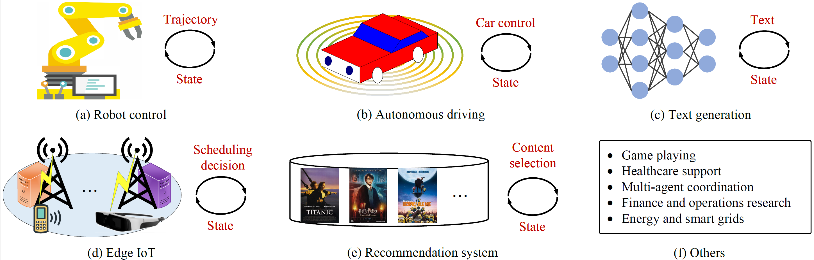

# Diffusion Models for Reinforcement Learning: Foundations,Taxonomy, and Development
This repository contains a collection of resources and papers on **Diffusion Models** for **Reinforcement Learning**.

:rocket: Please see our our survey paper [Diffusion Models for Reinforcement Learning: Foundations,Taxonomy, and Development](https://arxiv.org/abs/2510.12253)




Diffusion Models (DMs), as a leading class of generative models, offer key advantages for Reinforcement Learning (RL), including multi-modal expressiveness, stable training, and trajectory-level planning. This survey aims to deliver a comprehensive and up-to-date synthesis of diffusion-based RL, hoping to inspire new avenues of this research. 

## Contents：Taxonomy of DMs for RL.
- [DMs for Single-agent RL](#DMs-for-Single-agent-RL)
    - [Trajectory Optimization](#Trajectory-Optimization)
    - [Policy Learning](#Policy-Learning)
- [DMs for Multi-agent RL](#DMs-for-Multi-agent-RL)
    - [Joint Trajectory Generation](#Joint-Trajectory-Generation)
    - [Collaborative Policy Learning](#Collaborative-Policy-Learning) 
- [Citation](#citation)

## DMs for Single-agent RL
In single-agent RL, DMs have emerged as a novel paradigm to improve policy expressiveness, trajectory optimization, and goal-conditioned behavior. Traditional RL methods typically assume unimodal policy distributions (e.g., Gaussians), which are limited in capturing complex, multimodal, or stochastic behaviors often needed in real-world environments.

### Trajectory Optimization
Trajectory optimization methods treat RL as a conditional sequence generation problem, modeling entire state-action trajectories as data samples from an underlying distribution.

- **Text-driven human motion generation with diffusion model**, TPAMI 2024. [[paper](https://dl.acm.org/doi/10.1109/TPAMI.2024.3355414)] [[code](https://github.com/mingyuan-zhang/MotionDiffuse)]
- **Diffusion models as optimizers for efficient planning in offline rl**, ECCV 2024. [[paper](https://link.springer.com/chapter/10.1007/978-3-031-72983-6_1)] [[code](https://github.com/RenMing-Huang/TrajectoryDiffuser)]
- **Planning with Diffusion for Flexible Behavior Synthesis**, ICML 2022. [[paper](https://arxiv.org/abs/2205.09991)] [[code](https://github.com/jannerm/diffuser)]
- **Diffad: A unified diffusion modeling approach for autonomous driving**, arXiv 2025. [[paper](https://arxiv.org/abs/2503.12170)] [[code](https://github.com/wantsu/DiffAD)]
- **Polydiffuse: Polygonal shape reconstruction via guided set diffusion models**, NeurIPS 2023. [[paper](https://arxiv.org/abs/2306.01461)] [[code](https://github.com/woodfrog/poly-diffuse)]
- **Diffusiondrive: Truncated diffusion model for end-to-end autonomous driving**, CVPR 2025. [[paper](https://arxiv.org/abs/2411.15139)] [[code](https://github.com/hustvl/DiffusionDrive)]
- **Is Conditional Generative Modeling all you need for Decision-Making?**, ICLR 2023. [[paper](https://arxiv.org/abs/2211.15657)] [[code](https://github.com/xcvil/decision-diffuser/tree/main/code)]
- **AdaptDiffuser: Diffusion Models as Adaptive Self-evolving Planners**, ICML 2023. [[paper](https://arxiv.org/abs/2302.01877)] [[code](https://github.com/Liang-ZX/adaptdiffuser)]
- **Human Motion Diffusion Model**, ICLR 2023. [[paper](https://arxiv.org/abs/2209.14916)] [[code](https://github.com/guytevet/motion-diffusion-model)]

### Policy Learning 
Instead of generating entire trajectories, policy learning methods apply DMs at the action level, treating each action as the target of denoising

- **Diffusion recommender model**, SIGIR 2023. [[paper](https://arxiv.org/abs/2304.04971)] [[code](https://github.com/YiyanXu/DiffRec)]
- **Generate what you prefer: Reshaping sequential recommendation via guided diffusion**, NeurIPS 2023. [[paper](https://arxiv.org/abs/2310.20453)] [[code](https://github.com/YangZhengyi98/DreamRec)]
- **Diffusion-based reinforcement learning for edge-enabled ai-generated content services.**, TMC 2024. [[paper1](https://ieeexplore.ieee.org/document/10409284)] [[paper2](https://arxiv.org/abs/2303.13052)] [[code](https://github.com/Lizonghang/AGOD)]
- **Enhancing qoe in collaborative edge systems with feedback diffusion generative scheduling**, TMC 2025. [[paper](https://ieeexplore.ieee.org/document/11077726)] [[code](https://github.com/ChangfuXu/FDEdge)]
- **Diffusion-lm improves controllable text generation**, NeurIPS 2022. [[paper](https://arxiv.org/abs/2205.14217)] [[code](https://github.com/XiangLi1999/Diffusion-LM)]
- **Diffuseq: Sequence to sequence text generation with diffusion models**, ICLR 2023. [[paper](https://arxiv.org/abs/2210.08933)] [[code](https://github.com/Shark-NLP/DiffuSeq)] 
- **Diffusion Model is an Effective Planner and Data Synthesizer for Multi-Task Reinforcement Learning**, NeurIPS 2023. [[paper](https://arxiv.org/abs/2305.18459)] [[code](https://github.com/tinnerhrhe/MTDiff)]
- **Efficient Diffusion Policies for Offline Reinforcement Learning**, NeurIPS 2023. [[paper](https://arxiv.org/abs/2305.20081)] [[code](https://github.com/sail-sg/edp)]
- **Offline reinforcement learning with reverse diffusion guide policy**, TII 2024. [[paper](https://ieeexplore.ieee.org/document/10574882)] [[code]()]
- **Diffcps: Diffusion model based constrained policy search for offline reinforcement learning**, arXiv 2023. [[paper](https://arxiv.org/abs/2310.05333)] [[code](https://github.com/felix-thu/DiffCPS)]
- **Instructed Diffuser with Temporal Condition Guidance for Offline Reinforcement Learning**, arXiv 2023. [[paper](https://arxiv.org/abs/2306.04875)]
- **Diffusion Policies as an Expressive Policy Class for Offline Reinforcement Learning**, ICLR 2023. [[paper](https://arxiv.org/abs/2208.06193)] [[code](https://github.com/zhendong-wang/diffusion-policies-for-offline-rl)]
- **Contrastive Energy Prediction for Exact Energy-guided Diffusion Sampling in Offline Reinforcement Learning**, ICML 2023. [[paper](https://arxiv.org/abs/2304.12824)] [[code](https://github.com/thu-ml/cep-energy-guided-diffusion)]
- **Language Control Diffusion: Efficiently Scaling through Space, Time, and Tasks**, arXiv 2023. [[paper](https://arxiv.org/abs/2210.15629v2)] [[code](https://github.com/ezhang7423/language-control-diffusion)]

## DMs for Multi-agent RL
DMs can also be extended for multi-agent and hierarchical learning. In multi-agent systems, RL becomes more complex due to non-stationary environments, coordination requirements, and communication constraints in POMDPs. DMs offer a new perspective by enabling the modeling of joint or decentralized policies with rich, expressive behavior distributions, which can improve cooperation, communication, and robustness.

### Joint Trajectory Generation
The joint trajectory generation methods enable trajectory-level coordination and planning across multiple agents.

- **MotionDiffuser: Controllable Multi-Agent Motion Prediction using Diffusion**, CVPR 2023. [[paper](https://arxiv.org/abs/2306.03083)]
- **MADiff: Offline Multi-agent Learning with Diffusion Models**, arXiv 2023. [[paper](https://arxiv.org/abs/2305.17330)] [[code](https://github.com/zbzhu99/madiff)]
- **DoF: A Diffusion Factorization Framework for Offline Multi-Agent Decision Making**, ICLR 2025. [[paper](https://openreview.net/pdf?id=OTFKVkxSlL)] [[code](https://github.com/xmu-rl-3dv/DoF)]
  
### Collaborative Policy Learning
In collaborative policy learning, each agent’s trajectory is modeled as a conditional distribution, allowing for collaborative policy learning among multiple agents.

- **Enhancing llm qos through cloud-edge collaboration: A diffusion-based multi-agent reinforcement learning approach**, tsc 2025. [[paper](https://ieeexplore.ieee.org/document/10970093)]
- **Hierarchical Diffusion for Offline Decision Making**, ICML 2023. [[paper](https://openreview.net/forum?id=55kLa7tH9o)] [[code](https://github.com/ewanlee/HDMI)]
- **Diffusion-reinforcement learning hierarchical motion planning in adversarial multi-agent games**, xxx. [[paper](https://arxiv.org/abs/2403.10794)] [[code](https://github.com/ChampagneAndfragrance/Diffusion_RL)]
- **Beyond Conservatism: Diffusion Policies in Offline Multi-agent Reinforcement Learning**, arXiv 2023. [[paper](https://arxiv.org/abs/2307.01472)]
- **Diffusion-based multi-agent reinforcement learning with communication**, APWCS) 2024 [[paper](https://ieeexplore.ieee.org/document/10679289)]
- **Beyond local views: Global state inference with diffusion models for cooperative multi-agent reinforcement learning**, arXiv 2024. [[paper](https://arxiv.org/abs/2408.09501)]

## Citation
```
@article{xu2025diffusion,
  title={Diffusion Models for Reinforcement Learning: Foundations,Taxonomy, and Development},
  author={Xu, Changfu and Guo, Jianxiong and Liang, Yuzhu and Huang, Haiyang and Zou, Haodong and Zheng, Xi and Yu, Shui and Chu, Xiaowen and Cao, Jiannong and Tian, Wang},
  journal={arXiv preprint arXiv:https://arxiv.org/abs/2510.12253},
  year={2025}
}
```

